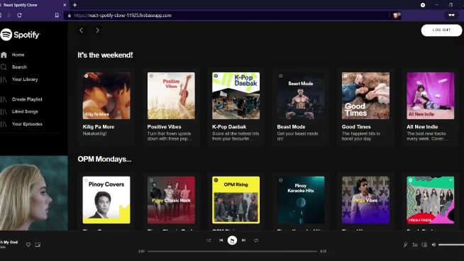
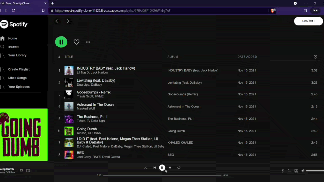
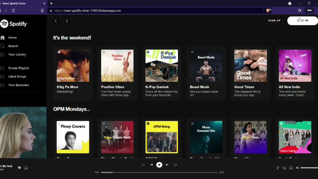
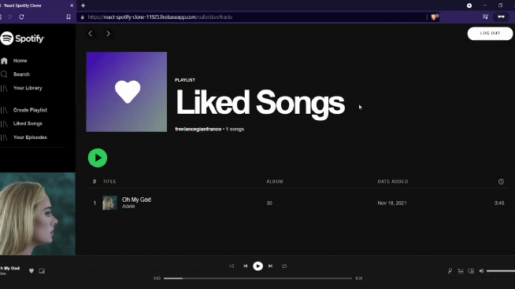
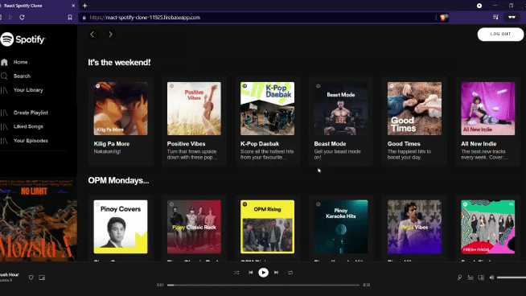

# React & Firebase Spotify Clone

> A sample GIF of the project showcasing its like track functionality.

---

### Table of Contents

- [React & Firebase Spotify Clone](#react--firebase-spotify-clone)
    - [Table of Contents](#table-of-contents)
  - [About The Project](#about-the-project)
      - [**What is it?**](#what-is-it)
      - [**Why is it built?**](#why-is-it-built)
      - [**How is it built?**](#how-is-it-built)
  - [More GIFs](#more-gifs)
    - [Like Playlist Functionality](#like-playlist-functionality)
    - [Log In Functionality](#log-in-functionality)
    - [Log Out Functionality](#log-out-functionality)
    - [Music Player Functionality](#music-player-functionality)
    - [Sign Up Functionality](#sign-up-functionality)
  - [References](#references)
  - [Author Info](#author-info)

---

## About The Project

> [**📺 View Demo 👀**](https://react-spotify-clone-11925.firebaseapp.com/)

#### **What is it?**

- A web app clone of Spotify with functionalities limited to the following:
  - Authentication
  - Like functionality for playlists and tracks
  - Music player functionality which plays previews of tracks _(30 second preview per track)_

#### **Why is it built?**

- Built for the purpose of showcasing my web app development capability with React, Firebase, and Node.js.

#### **How is it built?**

- First, a Node.js app _(that is not published here on GitHub)_ is created to get playlists and tracks sample data from Spotify using the Spotify Web API. Once the API is triggered to get Spotify sample data, the Node.js app saved these sample data to the Cloud Firestore of react-spotify-clone Firebase app. With sample data already available, react-spotify-clone Firebase app utilizes the sample data through Cloud Firestore queries.
  - [React](https://reactjs.org/)
  - [Firebase](https://firebase.google.com/)
  - [Node.js](https://nodejs.org/en/)
  - [Redux](https://redux.js.org/)
  - [Spotify Web API](https://developer.spotify.com/documentation/web-api/)
  - [SASS](https://sass-lang.com/)

[Back To The Top](#read-me-template)

---

## More GIFs

### Like Playlist Functionality

### Log In Functionality

### Log Out Functionality

### Music Player Functionality

### Sign Up Functionality

[Back To The Top](#read-me-template)

---

## References

- [How To Build A Better Spotify With React](https://youtu.be/Xcet6msf3eE)
- [React JS Tutorial - 05 How to log in to Spotify in web apps](https://youtu.be/G_WFk4wg9fk)
- [Spotify API in JavaScript Tutorial - Playlist Export](https://youtu.be/Bk90lT6ne3g)
- [How to Authenticate and use Spotify Web API](https://youtu.be/1vR3m0HupGI)
- [Reference for building a React app](https://youtu.be/1_IYL9ZMR_Y)

[Back To The Top](#read-me-template)

---

## Author Info

- LinkedIn - [GGianfranco](https://www.linkedin.com/in/ggianfranco/)
- Website - [ggianfranco.github.io](https://ggianfranco.github.io)
- Email - freelancegianfranco@gmail.com

[Back To The Top](#read-me-template)
